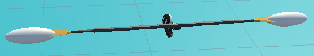

# Concept
Keeping with the Kayak theme, the interaction uses the paddle.
The interaction was redesigned to fit the goal of the game, which is to be used as an exercise tool.

The interaction now consists of a ghost paddle which the player must mimic with the real paddle.
They are tasked with holding their paddle in the same position as the ghost paddle for a certain amount of time.
After this, the paddle will reappear in a different spot and the player must repeat the process.

# Implementation
The paddle has two spheres attached to it, one at the top and one at the bottom.
These spheres are used to detect collision with the ends of the ghost paddle.


If both ends of the paddle collide with the ghost paddle ends, the paddle is considered to be in the correct position.
At this point, a counter is decremented for every physics frame that the paddle is in the correct position.
```csharp
void OnTriggerEnter(Collider other)
{
	if (other.CompareTag("RightEndTarget"))
	{
		inTarget = true;
	}
	if (other.CompareTag("LeftEndTarget"))
	{
		inTarget = true;
	}
}
```
```csharp
void FixedUpdate(){
	if (poleTriggerLeft.inTarget && poleTriggerRight.inTarget)
	{
		countdown -= 1.0f;
	}
}
```

The ghost paddle's position is always in the direction the player is looking while the rotation is randomized.
```csharp
targetPos = hmd.transform.position + hmd.transform.forward * 0.45f;
targerT = Instantiate(ghostPaddle, targetPos, new Quaternion(Random.Range(0.0f, 1.0f), Random.Range(0.0f, 1.0f), Random.Range(0.0f, 1.0f), Random.Range(0.0f, 1.0f)));
```

To stop the player from drifting past the ghost paddle their speed is set to zero once they enter the interaction.