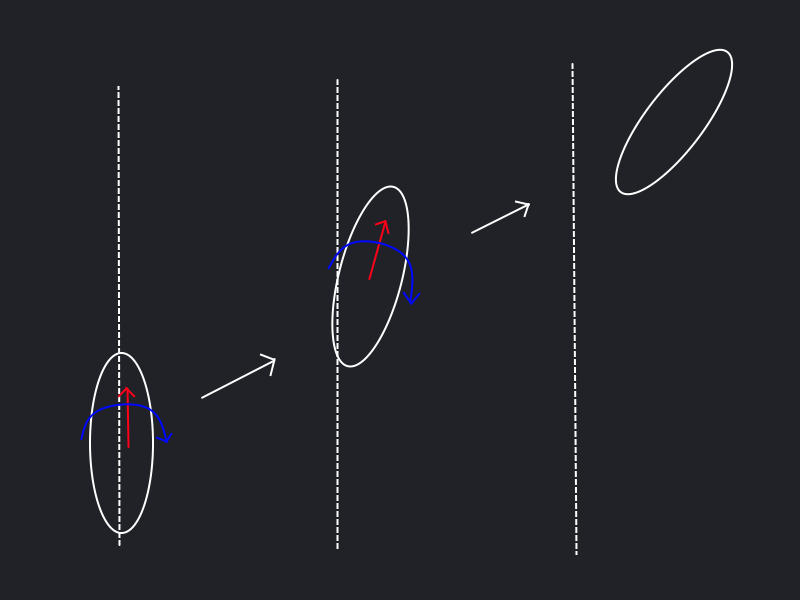
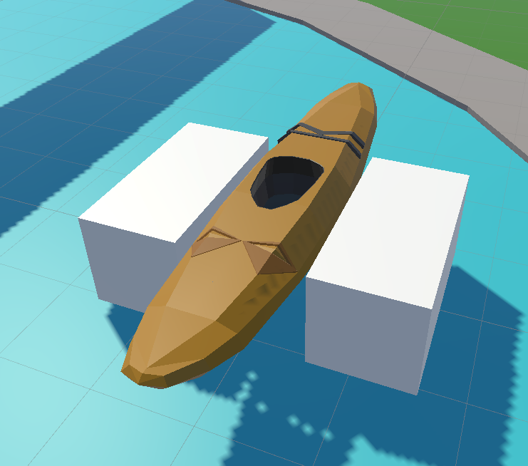

# The Premise
In order for the kayaking experience to feel satisfying the rowing should feel realistic.
This means that the boat should move in a way that feels natural.
But the boat should also move in a way that is consistent with the effort that the player puts into rowing.

To that end, the boat should experience drag when moving through the water.
This drag applies to both the movement as well as the rotation of the boat.
However, the drag should be different for the side-to-side movement and the forward movement since the boat is more streamlined in the forward direction.

So we need some kind of way to measure the effort that the player puts into rowing and apply that to the boat.
While applying an appropriate amount of drag to the boat.

# Boat Physics
The boat is a rigid body that is moved using Unity's physics engine.
It is moved by applying forces to the rigid body.

However, if we simply apply the wanted forces and rotation in a single frame we will get a result that is not very realistic.
As can be seen in the figure below the boat will move in a straight line and rotate when the expected outcome would be a turn.


The solution to this is to apply the forces and rotation over multiple frames.
When applying the forces this way the boat will make a turn as expected.
This leads to a more realistic result.


We then apply a drag force to the boat to simulate the drag that the boat experiences when moving through the water.
This drag is applied to both the movement as well as the rotation of the boat.
Since we want differing drag coefficients for the side-to-side movement and the forward movement we need to apply the drag in the local space of the boat.
However, simply applying the drag locally using ```
		rigidbody.AddRelativeForce(
		new Vector3(-localVelocity.x * sidewaysDrag, 0, -localVelocity.z * forwardDrag));
		``` causes unintended movement of the boat.
Instead, we take the global velocity of the boat and transform it into the local space of the boat and then apply the drag.
After applying the drag we transform the local velocity back into the global space and set the velocity of the boat to that value.
This gives us the desired result.
```csharp
var localVelocity = transform.InverseTransformDirection(rigidbody.velocity);
var newLocalVelocity = new Vector3(localVelocity.x * sidewaysDrag, 0, localVelocity.z * forwardDrag);
rigidbody.velocity = transform.TransformDirection(newLocalVelocity);
```
The rotational drag does not have these problems and we can simply use global coordinates.
```csharp
rigidbody.AddTorque(-rigidbody.angularVelocity * rotationalDrag);
```

This setup gives a satisfying simulation of the real behavior of a boat.

# Measuring the effort of the player
To measure the effort that the player puts into rowing we need to measure the force that the player applies to the boat.
This is done by measuring the speed at which the player moves the paddle through the water.

The velocity of the paddle is measured by taking the position of the paddle at the previous frame and the current frame whenever the paddle is in the water.
Whether the paddle is in the water is determined by two collision boxes that are attached to the boat.

The difference between these two positions is then calculated along the forward axis of the boat.
Since all forces are applied and calculated in FixedUpdate() the time between the two frames is constant.
The speed of the paddle is then used as a proxy for the force that the player has applied to the boat.
The force that the player has applied to a given side of the boat is stored between frames as _leftForce_ and _rightForce_.
Naturally rowing on the left side of the boat is counted towards _leftForce_ and visa-versa.

```csharp
var posLocal = gameObject.transform.InverseTransformPoint(paddlePosition);
var speed = -(posLocal - lastPosLocal).z;
lastPosLocal = posLocal;
leftForce += speed * dampen;
```

The player thus builds up a force on each side of the boat by rowing.

This force is then applied to the boat in FixedUpdate().
The forces that need to be applied are the forward force and the rotation.
The forward force is simply the sum of the forces on each side of the boat.
The rotation is calculated by taking the difference between the forces on each side of the boat.
These forces are then divided by the physics framerate of the game and clamped to a maximum value to prevent high accelerations.

```csharp
float forwardForceToApply = Mathf.Min((leftForce + rightForce) / 60, forwardClamp);
float rotationForceToApply = Mathf.Min(((leftForce - rightForce) / 60) * rotationDampening, rotationClamp);
```

After making sure that the player is not exceeding the set maximum speed the forces are applied to the boat using AddRelativeForce() and AddRelativeTorque().
```csharp
if (localVelocity.z < max_speed && forwardForceToApply > 0)
{
	rigidbody.AddRelativeForce(new Vector3(0, 0, forwardForceToApply));
}
else if (localVelocity.z > -max_speed && forwardForceToApply < 0)
{
	rigidbody.AddRelativeForce(new Vector3(0, 0, forwardForceToApply));
}
rigidbody.AddRelativeTorque(new Vector3(0, rotationForceToApply, 0));
```

Finally, the saved-up forces are decayed in each frame.
```csharp
rightForce = rightForce - rightForce / 60;
leftForce = leftForce - leftForce / 60;
```
This setup gives a satisfying simulation and allows the player to control the boat in a realistic way.
It also allows for the tweaking of multiple parameters to get the desired feel of the boat.